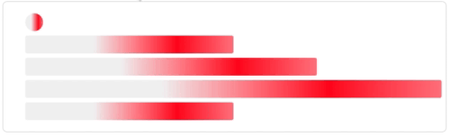

# CSS 骨架屏闪动背景原理

<div align="center">

</div>

```html
<div class="skeleton-wrapper">
  <ul>
    <li></li>
    <li></li>
    <li></li>
    <li></li>
    <li></li>
  </ul>
</div>
```

```less
.skeleton-wrapper {
  margin: 10px;
  border-radius: 10px;
  border: 1px solid #ccc;
  overflow: hidden;
  padding: 10px;
}

li {
  list-style: none;
  height: 40px;
  background: linear-gradient(90deg, #f2f2f2 25%, red 35%, #f2f2f2 50%);
  background-size: 400% 100%;
  border-radius: 4px;
  animation: skeleton-loading 1.4s ease infinite;
  background-position: 100% 50%;

  & + & {
    margin-top: 10px;
  }
  &:first-child {
    width: 40px;
    border-radius: 100%;
  }
  &:nth-child(2),
  &:last-child {
    width: 50%;
  }
  &:nth-child(3) {
    width: 70%;
  }
}

@keyframes skeleton-loading {
  0% {
    background-position: 100% 50%;
  }

  100% {
    background-position: 0% 50%;
  }
}
```

查看示例：[CodePen](https://codepen.io/xing_he/pen/dyGOGVp?editors=1100)

## 分析

在分析之前需要了解两个知识点: `background-position` 、`linear-gradient`

- linear-gradient：渐变色
- background-position：背景定位

第一个重点:

- `background-position: 100% 50%;`

> 等同于 left：{ `容器(container)的宽度` — `背景图片的宽度` } \* `left 百分比`，超出的部分隐藏  
> 等同于 right：{`容器(container)的高度` — `背景图片的高度` } \* `right 百分比`，超出的部分隐藏

这个地方看明白了！ **当容器宽高 > 背景图宽高时，是正数，反之是负数**

第二个重点:

- `background-size: 400% 100%;`

> 背景色的 **宽度** 是 400%，即四倍！容器宽度  
> 那么结合上边的 `background-position: 100% 50%;` 那么 (100%的容器宽度 - 400%的背景宽度) \* 100% = **`负300%`** 的宽度，那么横坐标上就向左移动 3/4 !!

> 当 `background-position: 0% 50%;` 时， (100%的容器宽度 - 400%的背景宽度) \* 0% = **`0%`**，即 0% 在初始的位置相当于不移动了嘛

第三个重点:

- `#f2f2f2 25%`

> 渐变色的第一个值 **长度** 设置的是 **25%**，不就 1/4 嘛，对应的刚好是，容器的长度！_那么动画执行的时候就保证了高亮部分能够看上去完全被滚动过了_

> > 在 _100%_ 的时候，即**`负300%`** 的宽度，左移 300%

```
[ 灰色部分 | 高亮部分 | 灰色部分 | 灰色部分 ]   // 背景色

                             [         ]  // 容器
```

> > 在 _0%_ 的时候，即**`0%`** 的宽度

```
[ 灰色部分 | 高亮部分 | 灰色部分 | 灰色部分 ]   // 背景色

[         ]                               // 容器
```

然后你想象下，背景色向右移动，不就由灰色进入到高亮，然后再进入到灰色部分了嘛，然后加个无限动画 infinite ，是不是清晰了

## 参考

- [CSS 中 background-position 使用技巧](https://www.cnblogs.com/ecmasea/p/9150595.html)
- [CSS 实现 Skeleton Screen 骨架屏效果](https://www.jb51.net/css/730828.html)
